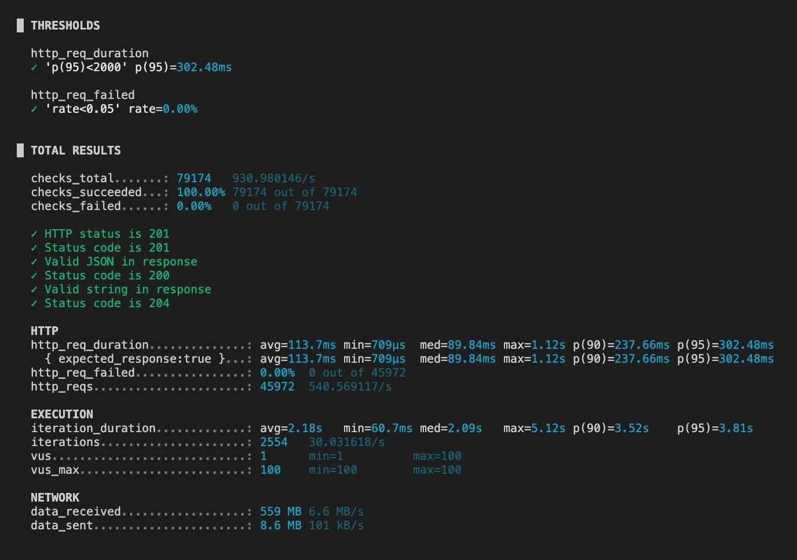
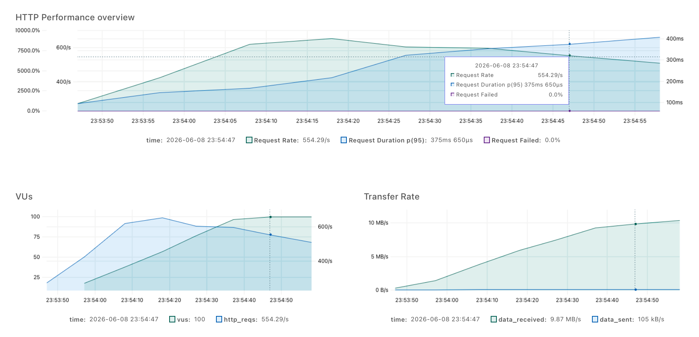

# Система спутников

## Описание системы

В проекте реализована система управления спутниками. Основные функции системы:

- создание спутников двух типов: спутника связи и спутника изображений
- создание группировки спутников
- добавление спутников в группировку
- управление миссиями спутников

## Системные требования

- Java версии 21 и выше
- Gradle
- Docker

## Запуск системы

Для запуска:

1. Откройте терминал в папке проекта.
2. Введите команду для запуска контейнеров:
```bash
   docker compose up -d --build
```
3. Дождитесь запуска контейнеров.

После этого проект станет доступен на порту `8080`, а его документация - http://localhost:8080/swagger-ui/index.html#/

## Нагрузочное тестирование

### Скрипт и профиль нагрузки

Скрипт для нагрузочного тестирования был экспортирован из Postman и конвертирован в js для k6 с помощью команды:

```
   npx postman-to-k6 ~/Projects/constellations.postman_collection.json -o load-script.js
```

Профиль нагрузки имеет общую длительность 85 секунд и следующие настройки:

- разгон от 0 до 50 виртуальных пользователей (25 секунд);
- разгон от 50 до 100 виртуальных пользователей (25 секунд);
- пик в 100 виртуальных пользователей (25 секунд);
- спад от 100 до 0 пользователей (10 секунд).

### Пользовательский сценарий

Сценарий в скрипте состоит из операций чтения `GET`, создания `POST` и модификации `PUT/DELETE`:

1. создание группировки (`POST /api/constellations`);
2. просмотр списка всех группировок (`GET /api/constellations`);
3. создание спутников связи и изображений (`POST /api/satellites`);
4. просмотр списка всех спутников (`GET /api/satellites`);
5. добавление спутника в группировку (`POST /api/constellations/{id}/satellites`);
6. просмотр мониторинга (`GET /api/overview`);
7. редактирование спутника (`PUT /api/satellites/{id}`);
8. просмотр списка всех энергосистем (`GET /api/energy-systems`);
9. редактирование энергосистемы (`PUT /api/energy-systems/{id}`);
10. запуск миссий для одного спутника и для всей группировки (`POST /api/missions`);
11. просмотр группировки по ID (`GET /api/constellations/{id}`);
12. просмотр спутника по ID (`GET /api/satellites/{id}`);
13. просмотр энергосистемы по ID (`GET /api/energy-systems/{id}`);
14. удаление спутника (`DELETE /api/satellites/{id}`);
15. удаление группировки (`DELETE /api/constellations/{id}`).

### Запуск тестирования 

#### Подготовка к тестированию

Перед запуском нагрузочного тестирования необходимо убедиться, что контейнеры системы запущены и доступны.

#### Запуск тестирования

Для запуска:

1. Откройте терминал в папке проекта.
2. Перейдите в папку `load-tests`.
3. Введите команду для запуска тестов и генерации отчета:
```bash
   k6 run --out web-dashboard=export=report.html load-script.js  
```

#### Отчет 

Отчет в формате `html` появляется в папке после тестирования.





